<div align="center">


# Obol

**The buyer in a room of sellers.**

An autonomous agent with a USDC budget that discovers paid services, pays each per call on Arc, scores what it gets back, and reallocates its budget toward the ones that deliver — cutting off the ones that don't.

[](https://obol-arc.vercel.app)
[](https://explorer.arc.io/address/0xDCaf0CcB73fcd81b28099f27A784EA815FB630BE)
[](https://repo.sourcify.dev/5042/0xDCaf0CcB73fcd81b28099f27A784EA815FB630BE)
[](./LICENSE)
[](https://docs.arc.io)


</div>

> Every economy mints a smallest coin. Paid agent APIs are multiplying on Arc: HTTP 402, pay per call, USDC. The hard question is on the buyer's side: **which of them are worth paying?** Obol pays them for real on Arc mainnet, scores what they deliver, stops paying the ones that fail, and publishes each verdict, with the payment evidence attached, to an on-chain registry any other agent can read before it spends.

---

## Live on Arc mainnet

| | |
|---|---|
| Dashboard (reads the chain in your browser) | https://obol-arc.vercel.app |
| ReputationRegistry v2 | [`0xDCaf0CcB73fcd81b28099f27A784EA815FB630BE`](https://explorer.arc.io/address/0xDCaf0CcB73fcd81b28099f27A784EA815FB630BE) |
| Source verified | [Sourcify, exact match](https://repo.sourcify.dev/5042/0xDCaf0CcB73fcd81b28099f27A784EA815FB630BE) (creation + runtime bytecode, metadata hash included) |
| Deploy tx | [`0xe66a…e174`](https://explorer.arc.io/tx/0xe66a6350a29a972da7579c1b13e3813d044c1ead15081bf842c18dd43b0ce174), block 23,432,651, from the agent wallet |
| Deployment record | [`deployments/5042/ReputationRegistry.json`](deployments/5042/ReputationRegistry.json) + the exact [compiler input](deployments/5042/ReputationRegistry.standard-input.json) |
| Agent wallet | [`0x4a36Df350507d974C882Ac89f402215340d67f55`](https://explorer.arc.io/address/0x4a36Df350507d974C882Ac89f402215340d67f55) |
| ERC-8004 identity | agent `#345` in the canonical IdentityRegistry `0x8004A169…a432` |

Check it yourself: `curl -s https://sourcify.dev/server/v2/contract/5042/0xDCaf0CcB73fcd81b28099f27A784EA815FB630BE` returns `"match":"exact_match"`. Or rebuild it: `cd contracts && forge build && diff <(forge inspect ReputationRegistry deployedBytecode) <(cast code 0xDCaf0CcB73fcd81b28099f27A784EA815FB630BE --rpc-url https://rpc.mainnet.arc.io)` prints nothing.

Obol pays real third-party sellers on Arc mainnet:

- **Exa** web search: paid by EIP-3009 `exact` transfer, settled on Arc. The evidence stored with the score is the Arc tx hash.
- **CRA AGENT** Arc chain data: paid through **Circle Gateway** batched payments. Obol checks the returned block height against the live Arc head, so stale data scores low.
- **CRA self-test** (`/selftest/fail`): always answers HTTP 500 and never charges. Obol retires it on-chain after three free calls. That is the delivery gate working on a real endpoint at zero cost.

Every registry write carries its evidence (`0x…` tx hash, `gateway:<transfer id>`, or `no-payment:http-<code>`), the provider's URL, and the block it was written in, so the dashboard and anyone else can find the exact write with a single-block query. No indexer, no backend.

The Lepton (testnet) deployment `0xd893…9d70` remains on Arc testnet for history.

<p align="center"></p>

---

## Get scored by Obol

**Run a paid x402 endpoint on Arc mainnet? Obol will pay it per call and publish its score on-chain, with receipts.**

**→ [Open a "Get scored" issue](https://github.com/Makabeez/obol/issues/new?template=get-scored.yml)**, or DM [@GeiserJoe2](https://x.com/GeiserJoe2) / `Makabeez` on the Canteen Discord, with three things: your endpoint URL, your price per call (up to 0.01 USDC), and your payTo address.

What you get:

- **Real paid calls** in USDC on Arc mainnet, from an agent with an ERC-8004 identity (#345)
- **A public score with receipts**: every write stores the payment it is based on (Arc tx hash or Gateway transfer id) and your endpoint URL, on-chain
- **A spot on the live dashboard**, which picks up new sellers from the chain automatically
- **Visibility to every agent that checks the registry before paying**: a good score means more buyers

Your endpoint needs x402 v2 on Arc mainnet (`eip155:5042`, Arc USDC), via `exact` (EIP-3009) and/or Circle Gateway batched. Scoring is based only on what Obol can verify itself (delivery, promised fields, latency, freshness of Arc data). Sellers that keep failing are retired, and retirement is reversible once fixed. Full rules and the onboarding checklist: **[docs/GET-SCORED.md](docs/GET-SCORED.md)**.

## Read the registry before you pay

The registry is public: any agent can check a seller before it spends. **[obol-kit](https://github.com/Makabeez/obol-kit)** packages that as one call (plus the pay-before-attest writer, if you want to run your own registry):

```js
import { checkBeforePay } from "obol-kit/reader";   // npm i github:Makabeez/obol-kit

const v = await checkBeforePay("exa-search", { minScoreBps: 5000, minCalls: 3 });
// { pay: true,  reason: "score 72.19/100 over 7 calls", record: {...} }
// checkBeforePay("cra-selftest-fail") -> { pay: false, reason: "retired on-chain after 3 calls (score 20/100)" }
```

No key, no backend: two `eth_call`s against Arc mainnet, plus a single-block `eth_getLogs` if you want the evidence behind the score.

---

## Why

The RFBs ask for agents that *discover, evaluate, and pay for services on a budget* (RFB 1), that *sell their work per call* (RFB 2), and that *form agent-to-agent payment networks* (RFB 3). Almost everyone ships the seller. The seller is the easy half — slap HTTP 402 on an endpoint. The buyer is where the agency lives: with finite USDC and noisy providers, **what do you buy, how much, and when do you stop?**

That is a capital-allocation problem. Obol treats every provider like a position: size into the ones with edge, keep probing the cheap unknowns in case they're alpha, and cut the losers the moment you're confident they're losers. The smartness is the allocation, not the plumbing.

It also produces a public good. Each thing Obol learns — *this provider delivers, that one takes your money and returns nothing* — gets written to an on-chain `ReputationRegistry` any other agent can read before it pays. One buyer's experience, priced in USDC, posted for the whole network.

## Architecture

```
                          +-----------------------------+
   request -------------> |          Obol agent         |
                          |  (buy / evaluate / record)  |
                          +--------------+--------------+
                                         |
              select (Thompson on edge)  |  observe (quality, cost)
                                         v
                          +-----------------------------+
                          |        ValueBandit          |   <- the differentiator
                          |  per-provider Beta posterior|
                          |  edge gate + delivery gate  |
                          +--------------+--------------+
                                         |
                           pay_and_fetch | (x402)
                                         v
   +--------------+        +-----------------------------+        +------------------+
   |  Evaluator   | <----- |         Arc adapter         | -----> |  Reputation      |
   | prog + LLM*  | result | sim (no creds) | live: x402 | score  |  Registry (Arc)  |
   +--------------+        | sidecar, exact + Gateway    |        +------------------+
                          +-----------------------------+
        * LLM judge is Anthropic-only (wallet-adjacent decision; never a 3rd-party model).
```

One seam — the **Arc adapter** — separates the brain from the chain. `SimArcAdapter` runs anywhere with no creds, so the allocation logic can be tested and demoed offline. `LiveArcAdapter` drives the same interface through the local sidecar (`sidecar/payer.mjs`), which holds the key and pays x402 sellers on Arc mainnet. Flipping `--sim` to `--live` changes no call sites.

## Tech stack

| Layer            | Choice                                              | Why |
|------------------|-----------------------------------------------------|-----|
| Allocation       | Thompson sampling over value-per-USDC (Beta posteriors) | Explore/exploit under a hard budget; the agency the rubric weights |
| Adaptivity       | Evidence decay + epsilon re-exploration             | Re-evaluates a live market; tracks providers whose quality drifts |
| Cut-off          | Delivery gate (non-decaying) + edge gate            | Retires scammers that take payment and return nothing; starves the merely-mediocre |
| Payments         | x402 v2 client with two rails: EIP-3009 `exact` (Circle Facilitator) + Circle Gateway batched | Pays whichever rail the seller offers; prefers `exact` because its evidence is an Arc tx |
| Settlement       | Arc mainnet (5042), USDC gas, sub-second finality     | A score write costs ~0.001 USDC on mainnet (measured), so publishing every verdict is economical |
| Reputation       | `ReputationRegistry` v2 (Arc mainnet) + ERC-8004 identity | Public track record per provider, with payment evidence |
| Guardrails       | Sidecar-enforced allowlist, payTo pins, Arc-only, per-call + lifetime caps | The brain decides; it can never overspend or pay a stranger |
| Evaluation       | Programmatic + optional Anthropic judge             | Free signal first; LLM only for substance, Anthropic-only |
| Dashboard        | Static page, zero dependencies, reads Arc RPC directly | Nothing to trust but the chain |

## Flow

1. **Discover** — load the provider registry (x402 endpoints). Live: pulled from the services other teams ship.
2. **Select** — `ValueBandit` samples each live provider's likely quality, divides by its advertised price, and buys from the best draw.
3. **Pay** — the Arc adapter settles the provider's 402 challenge in USDC (gasless batch via Gateway), gets the payload.
4. **Evaluate** — score the result in `[0,1]`: programmatic by default, Anthropic judge for substance.
5. **Update** — feed the score back to the bandit. Append to the ledger. Periodically publish the provider's running quality score on-chain.
6. **Cut** — once confident a provider's edge or delivery is below the floor, retire it. Repeat until the budget is dry.

## Smart contract

`contracts/src/ReputationRegistry.sol` (v2) — delivered-quality scores (0–10000 bps), written by Obol as it spends, readable by anyone.

```solidity
function describe(bytes32 providerId, string uri) external onlyOwner;
function recordScore(bytes32 providerId, uint16 scoreBps, uint64 calls, string evidenceRef) external onlyOwner;
function retire(bytes32 providerId, uint16 scoreBps, uint64 calls, string evidenceRef) external onlyOwner;
function scoreOf(bytes32 providerId) external view returns (Record memory); // score, calls, updatedAt, updatedBlock, retired, evidenceHash
function uriOf(bytes32 providerId) external view returns (string memory);
```

7 Foundry tests including a fuzz test (`cd contracts && forge test`), exercised on an Arc mainnet fork. Unaudited; the agent key that owns it holds only a few USDC.

## Local dev

```bash
pip install -r requirements.txt

# run the buyer against simulated sellers (no creds needed)
python -m obol.cli run --sim --budget 2 --seed 7 --min-edge 0.05

# the dashboard is a static page that reads Arc mainnet straight from your browser
python -m http.server 8099 -d site
# open http://localhost:8099

# tests (the allocator is the differentiator, so it carries the real ones)
python -m pytest -q
```

What a sim run shows: the agent concentrates spend on the cheap high-quality provider, probes the unknowns, and retires the rug-seller (takes payment, delivers nothing) after a handful of calls — a real decision, not a script.

## Deployment (Arc mainnet)

Full runbook, with every address and gas figure verified on mainnet: **[docs/MAINNET.md](docs/MAINNET.md)**.

```
Python brain (bandit + evaluator)  --localhost-->  sidecar/payer.mjs  --x402-->  sellers
                                                  (only key holder,           (Exa, CRA AGENT)
                                                   all guardrails)  --tx-->  ReputationRegistry on Arc
site/index.html  --JSON-RPC-->  Arc mainnet   (static, no backend)
```

## Attribution

First built for the **Lepton Agents Hackathon** (Canteen × Circle on Arc testnet); moved to **Arc mainnet** in September 2026. Uses Circle's stack end to end: x402 with the Facilitator Service (`exact`, EIP-3009), Circle Gateway batched payments, CCTP v2 via Bridge Kit for funding, and the canonical ERC-8004 identity registry on Arc.

## License

MIT — see [LICENSE](./LICENSE).
